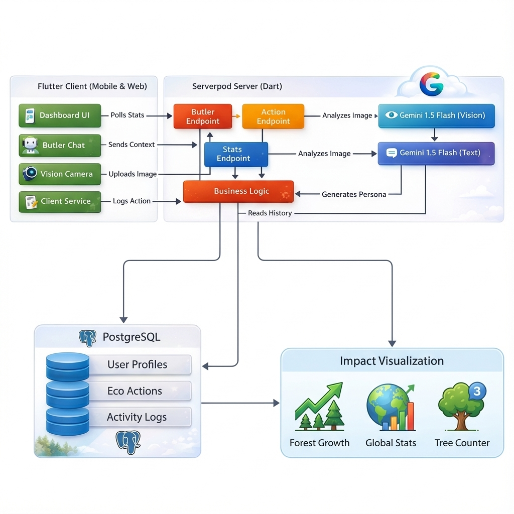

# Carbon Footprint Tracker 🌿

**A digital companion for the modern eco-conscious citizen.**

This application is designed to help users track, visualize, and reduce their carbon footprint through a premium, gamified experience. By combining rigorous scientific formulas with an engaging "Forest" metaphor and an AI-powered Butler, we turn the chore of sustainability into a rewarding daily journey.

---

## 🌟 Key Features

*   **Eco Dashboard**: Real-time visualization of your carbon budget, remaining allowance, and current forest status.
*   **The Forest**: A visual representation of your progress. As your Eco Score grows, your forest evolves from a "Fledgling Woods" to an "Earth Guardian Realm."
*   **Eco-Envisioning Simulator**: A powerful tool to project future savings by simulating lifestyle changes like Solar installation or EV adoption.
*   **Action Logging & PDF Vision**: Log actions manually or simply **upload a PDF energy bill** or a meal photo. The AI extracts the data automatically.
*   **Social & Global Impact**: Compete on leaderboards and see the collective CO2 savings of the entire community.
*   **Global Refresh**: Instantly sync your data across the entire app with a single tap.

---

## 🤖 The Eco Butler

Meeting you at the intersection of technology and service, the **Eco Butler** is your proactive AI assistant powered by **Google Gemini**.

*   **Context-Aware Briefings**: Not just a morning greeting—the Butler recognizes if it's afternoon, evening, or night, adjusting its tone and UI theme accordingly.
*   **Smart Nudges**: Noticed you missed logging lunch? The Butler politely reminds you to stay on track.
*   **Photo & PDF Intelligence**: Far from a simple chatbot, the Butler can "see" your documents and photos to help you log actions effortlessly.
*   **Insights**: Analyzes your data patterns to offer tailored advice (e.g., "I notice your transport emissions peak on Tuesdays...").

---

## 🧮 Logic & Math (The "Clean & Corrected" Standard)

We believe in transparency. Here is exactly how your impact is calculated:

### 1. Baseline Calculation 📉
Your customized monthly carbon budget is established by annualizing your weekly habits and dividing by 12.
*   **Driving**: `(km_per_week * 0.2 kg * 52) / 12`
*   **Meat**: `(meals_per_week * 2.5 kg * 52) / 12`
*   **Electricity**: `(monthly_bill_USD * 0.5 kg)`
*   **Total**: Sum of the above.

### 2. Forest Ranks (Unified 5-Tier System) 🌲
Your Eco Score determines both your text rank and the visual state of your forest.
*   **0 - 499**: Fledgling Woods *(Misty/Autumn)*
*   **500 - 1499**: Verdurous Grove *(Standard)*
*   **1500 - 2999**: Blooming Canopy *(Lush)*
*   **3000 - 4999**: Emerald Sanctuary *(Solar/Vibrant)*
*   **5000+**: Earth Guardian Realm *(Eco Utopia)*

### 3. Tree Impact 🌳
We use a scientifically grounded conversion factor for mature trees.
*   **Formula**: `Total CO2 Saved (kg) / 20`
*   *Example: 100kg CO2 saved = 5 Trees planted.*

### 4. Eco Score 🏆
A straightforward gamification metric.
*   **Formula**: `Total CO2 Saved (kg) * 10`
*   *1 kg saved = 10 points.*

### 5. Eco-Envisioning Simulator 🔮
Projected savings based on standard efficiency models.
*   **Solar Savings**: `Coverage% * 4000 kg/yr` (Assuming ~4000kg savings for 100% solar on a standard home).
*   **EV Savings**: `Weekly_km * 52 * 0.10 kg` (Net reduction vs. gas vehicle).

### 6. Global Impact 🌍
*   **Formula**: Sum of ALL CO2 saved by ALL users in the database.

---

## 🚀 Getting Started

To run the Carbon Footprint Tracker locally or prepare it for deployment, follow these steps:

### 1. Backend (Serverpod)
The backend requires Docker for Postgres and Redis (optional).

1.  Navigate to the server directory:
    ```bash
    cd carbon_footprint_server
    ```
2.  Start the database:
    ```bash
    docker compose up --build --detach
    ```
3.  Run the server:
    ```bash
    dart bin/main.dart
    ```

### 2. Frontend (Flutter)
1.  Navigate to the flutter directory:
    ```bash
    cd carbon_footprint_flutter
    ```
2.  Install dependencies:
    ```bash
    flutter pub get
    ```
3.  Run the app:
    ```bash
    flutter run
    ```

---

## 🏆 Hackathon Readiness

This project is built for the **Flutter Butler Hackathon**.

- [x] **Project Built with Flutter + Serverpod**: Core stack confirmed.
- [x] **The Butler Theme**: Managed via `Eco Butler` AI implementation in `butler_endpoint.dart`.
- [x] **Functionality**: Fully implemented dashboard, forest evolution, and AI briefings.
- [ ] **Repository URL**: [Insert your Repo URL here]
- [ ] **Demo Video**: [Insert your Video Link here]

---

## 🏗️ System Architecture



## 🚀 Technical Stack

*   **Frontend**: Flutter (Mobile & Web) - *Glassmorphism Design System*
*   **Backend**: Serverpod (Dart) - *Scalable & Typesafe*
*   **AI**: Google Gemini (Flash Model) - *Generative Text & Insights*
*   **Database**: PostgreSQL
*   **Deployment**: Google Cloud Run (Targeted)

---

*Crafted for a greener tomorrow.*
